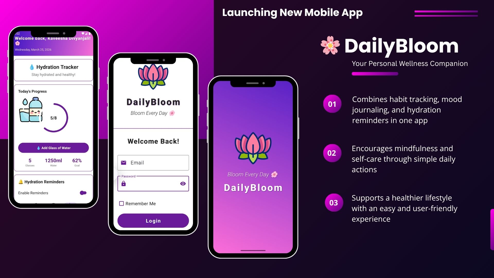

# 🌸 DailyBloom – Your Personal Wellness Companion  

DailyBloom is a mobile application designed to support users in maintaining their mental and physical well-being through simple daily habits. By combining habit tracking, mood journaling, and hydration reminders, DailyBloom encourages consistency, mindfulness, and a healthier lifestyle.

Built as a Mobile Application Development (MAD) project, the app focuses on simplicity, interactivity, and a calming user experience that helps users grow daily and “bloom” into their best selves.

This project was designed and developed using Android Studio with Kotlin, following modern architecture patterns to ensure clean code and smooth performance.

---

## 🖼️ App Design Overview  
Below are some images showcasing the DailyBloom application:  
 

  

---

## 🎯 Purpose of the Application  
DailyBloom was created to solve common daily wellness challenges by helping users stay consistent with small but meaningful habits.

- Encourage daily self-care and mindfulness  
- Help users track habits and emotional well-being  
- Promote proper hydration through reminders  
- Provide a simple, all-in-one wellness companion  
- Support a balanced and healthier lifestyle  

---

## ⭐ Key Features  

### 🌱 Daily Habit Tracker  
- Add, edit, and delete daily habits (e.g., Drink Water, Meditate, Exercise)  
- Mark habits as completed and track progress visually  
- View completion percentage for daily motivation  
- Smooth animations and interactive UI  

---

### 😊 Mood Journal with Emoji Selector  
- Log daily moods using expressive emojis  
- Add optional notes for deeper reflection  
- View mood history to identify emotional patterns  
- Encourages self-awareness and mindfulness  

---

### 💧 Hydration Reminder  
- Get timely notifications to drink water  
- Uses reliable background services (AlarmManager / WorkManager)  
- Helps maintain healthy hydration habits  

---

## ✅ Benefits of DailyBloom  

- Encourages consistency in daily habits  
- Supports both mental and physical well-being  
- Promotes mindfulness and self-reflection  
- Works completely offline (no internet required)  
- Simple, lightweight, and user-friendly  
- Beautiful calming UI with smooth interactions  

---

## 🛠️ Technologies & Tools Used  

- 🎨 Figma – UI/UX design  
- 📱 Android Studio – App development  
- 💻 Kotlin – Programming language  
- 🧩 XML Layouts – UI design  
- 🧠 MVVM Architecture – Clean code structure  
- 💾 SharedPreferences – Local data storage  
- 📊 MPAndroidChart – Data visualization  
- 🔔 AlarmManager / WorkManager – Notifications  

---

## 🎥 Demo Video  
▶️ Watch the DailyBloom demo video:  👉 [Click here to watch](https://drive.google.com/file/d/1pQLtq1gCmiN21esk-lXeycPcyh_Nk2pg/view?usp=drive_link)  

---

## 💡 Why DailyBloom?  

DailyBloom is not just a tracker — it’s a daily self-care companion that helps users focus on small, meaningful actions. By integrating habit tracking, mood monitoring, and hydration reminders, it promotes a balanced lifestyle and a positive mindset.

🌸 *“Small steps every day lead to a blooming life.”*  🌸

---

## 🙏 Thank You for Exploring DailyBloom  
Let’s grow, improve, and bloom every day 🌸🌿✨  
